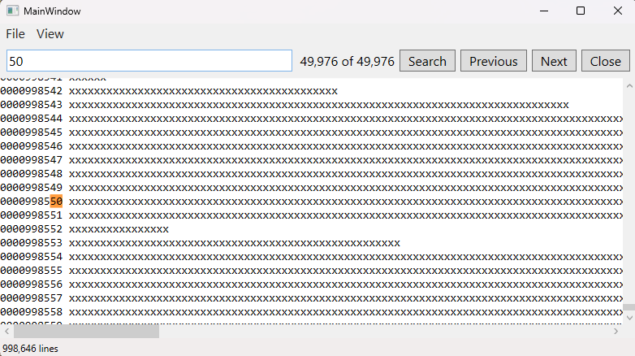
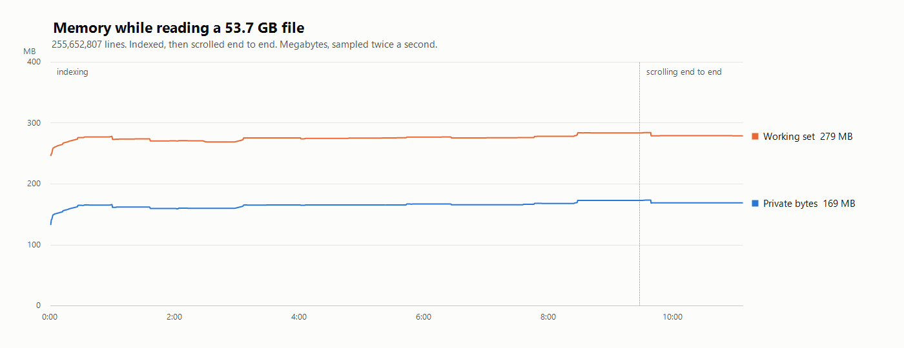

# BigTextReader

A WPF viewer for text files of tens of gigabytes. BigTextReader never loads the file into memory.
It locates lines through a sparse index and reads them on demand. The ceiling is disk space, not
RAM.



The index holds the byte offset of every thousandth line. For the 53.7 GB test file, that is about
2 MB of offsets. One offset for each of its 255,652,807 lines would need 1.9 GB instead. Reaching
a line between two checkpoints means seeking to the preceding one and scanning forward from there.

Because the assignment rules out off-the-shelf editor components, the view is a custom control. It
implements `IScrollInfo` and draws only the lines that fit on screen, around 20 in a default-sized
window, which makes a repaint cost the same whatever the file size.
Scrolling works in pixel offsets rather than line numbers, so a line can sit half off the top edge.
Horizontal scrolling slices the line string, and a very long line stays as cheap to draw as a short
one.

## Supported files

BigTextReader reads UTF-8, with or without a byte order mark. ASCII is a subset of UTF-8 and works
unchanged. The file extension doesn't matter.

LF and CRLF line endings both work. The decoder strips the carriage return before it draws a line.

| Input | Result |
|---|---|
| UTF-8, no mark | Read normally. |
| UTF-8 with a byte order mark | Read normally. The reader skips the 3-byte mark. |
| UTF-16 or UTF-32, either byte order | Refused. The status bar reads `Unsupported BOM - only ASCII/UTF-8 is supported`. |
| Another 8-bit encoding, such as windows-1252 | Opens, and every byte outside ASCII becomes a replacement character. Nothing in the file identifies these encodings. |
| Line breaks written as carriage returns alone | Opens as one line. The scanner splits on line feed only. |
| A binary file | Opens, and the decoder produces meaningless text. `less` and Notepad behave the same way. |

### Limits

- The view never wraps a line. A long line runs off to the right and you scroll to follow it.
- The view cuts a line longer than 256 KiB and appends a truncation marker. The file itself stays
  untouched, and saving it copies every byte.
- A line longer than 4 MiB leaves the rest of its 1000-line block unreachable. Those lines
  display as empty.
- Search stops after 262,144 matches and then reports the count with a trailing `+`.
- Indexing a very large file takes minutes and there's no way to cancel it. The 53.7 GB test file
  took 7 minutes 51 seconds. Text and the line count appear while the scan runs, which keeps the
  window usable throughout, and opening another file replaces the scan in progress.

## Usage

The File menu offers three sources. All three end up as a file on disk that the reader indexes,
and they behave identically once open. Open File reads the file you pick. The other two write a
temporary file first.

| Command | Shortcut | Action |
|---|---|---|
| Open File | `Ctrl+O` | Opens a file you pick. |
| Open URL | `Ctrl+U` | Downloads a page into a temporary file, then opens it. |
| Generate Text | `Ctrl+G` | Writes up to 1,000,000 random lines, optionally prefixed with the line number, then opens the result. |
| Save File | `Ctrl+S` | Copies the open file byte for byte to a path you pick. |
| Find | `Ctrl+F` | Shows the search bar and selects whatever is in it. |

BigTextReader deletes the temporary files it created when you close it.

### Search and navigation

Searching scans the whole file. It starts when you press Enter or click Search, never while you
type: a full pass over 53.7 GB takes minutes, and searching as you type would queue one of those
per keystroke. The status bar shows the phase and a progress bar while a scan runs. Every match is
highlighted, and the current one uses a second colour.

`Enter` runs the search. `F3` and `Shift+F3` step forward and back through the matches, and
`Escape` closes the search bar and hands focus back to the text. The arrow keys, `Page Up`,
`Page Down`, `Home`, `End` and the mouse wheel all scroll.

Wheel and page scrolling ease into place instead of jumping, and so does moving to a match within
about three screens. Past that the view jumps. Home and End always jump, which is what other
software does.

## Measured results

The 53.7 GB test file holds 255,652,807 lines. Indexing it took 7 minutes 51 seconds, limited by
disk throughput. Afterwards, reading any line took 22 ms or less, including line 255,000,000.



Memory stays flat across the whole run: 169 MB of private bytes with the file open, against 53.7 GB
on disk.

## Prerequisites

### Run the published executable

- Windows 10 or Windows 11, x64. WPF runs only on Windows.
- Nothing else. The executable carries the .NET runtime with it. There's no framework to install.

The first launch takes longer than later ones. The single file unpacks its native components into
a temporary folder and caches them there.

### Build from source

- .NET SDK 10.0 or newer. Run `dotnet --version` to check. This build used 10.0.401.
- Windows, for the same reason as above, though only the UI project needs it.
  `BigTextReader.Core` targets plain `net10.0`, and the engine and its tests build anywhere.
- Visual Studio, optionally. The solution file `TextReaderAssignment.slnx` uses the newer `.slnx`
  format, which an older Visual Studio may not open. Every command below runs from the `dotnet` CLI.

## Build and test

```
dotnet build
dotnet test
```

`dotnet build` builds all three projects.

## Publish the standalone executable

```
dotnet publish BigTextReader.App/BigTextReader.App.csproj -c Release -r win-x64 --self-contained -p:PublishSingleFile=true -p:IncludeNativeLibrariesForSelfExtract=true -p:EnableCompressionInSingleFile=true -o publish
```

The result is `publish/BigTextReader.App.exe`, 61.9 MB.

## Project layout

| Project | Target | Contents |
|---|---|---|
| `BigTextReader.Core` | `net10.0` | Indexing, caching, search, encoding, file and URL loading. No UI dependency. |
| `BigTextReader.App` | `net10.0-windows` | WPF shell. Holds the virtualised text view, the view model, and the dialogs. |
| `Tests` | `net10.0` | xUnit tests for `BigTextReader.Core`. |

## Possible improvements

- The filtered view. I ran out of time before starting it.
- Cancel button for ongoing operations.
- Blocks have a 4 MiB limit. Once a block hits it, the remaining lines in that block are omitted.
- Allow more encodings.
